# Jana Wäechter

### Digital Marketing Specialist
Paid Media Specialist • SEO

I build and optimize growth strategies that increase visibility, generate qualified leads, and improve acquisition performance across international markets.

With 5+ years of experience in digital marketing, I've managed multilingual campaigns across paid media, SEO, and growth marketing for companies in wellness, tech, and Web3.

---

### Specializations
- Performance Marketing
- Paid Media Strategy
- SEO & Organic Growth
- International Audience Acquisition
- Conversion Optimization
- Lead Generation
- Growth Strategy
- Campaign Analytics & Reporting
- Funnel Optimization
- Cross-Channel Marketing

---

### Platforms & Tools
Google Ads • Meta Ads Manager • Meta Business Suite • LinkedIn Ads Manager • X Ads • Google Analytics (GA4) • Google Search Console • SEMrush • HubSpot • Mailchimp • WordPress • Figma • Canva • ClickUp • DocuSign • Loom • ChatGPT • VEO 3

---

### Languages
Portuguese • English • French • Spanish

---

# About Me

I'm a digital marketing specialist with over five years of experience developing and optimizing performance-driven marketing strategies for international companies.

My background spans paid media, SEO, lead generation, conversion optimization, and growth marketing across both B2B and B2C environments. I've worked with companies ranging from wellness brands to tech and Web3 businesses, managing campaigns focused on scalable growth, audience acquisition, and measurable business impact.

Over the years, I've managed campaigns across Google Ads, Meta Ads, LinkedIn Ads, X Ads, SEO initiatives, and multi-channel growth strategies targeting audiences in different countries and languages. Working in international environments has strengthened both my strategic adaptability and my ability to understand audience behavior across markets.

I approach marketing through a performance and systems-oriented mindset: identifying opportunities, analyzing data, improving conversion paths, and continuously optimizing campaigns based on measurable outcomes.

Beyond execution, I focus heavily on strategy, positioning, and long-term growth. I believe effective marketing is built through a combination of analytical thinking, clear communication, and creative problem-solving.

---

### Professional Highlights
- 5+ years of experience in digital marketing and growth strategy
- Experience managing multilingual and international campaigns
- Background in paid media, SEO, lead generation, and conversion optimization
- Experience across wellness, technology, and Web3 industries
- Strong analytical and performance-focused approach
- Experience working with U.S. and international companies

---

### Core Focus Areas
Performance Marketing • SEO • Growth Strategy • Paid Media • International Marketing • Audience Acquisition • Conversion Optimization • Analytics & Reporting

---

# Paid Media Campaign Management & Optimization

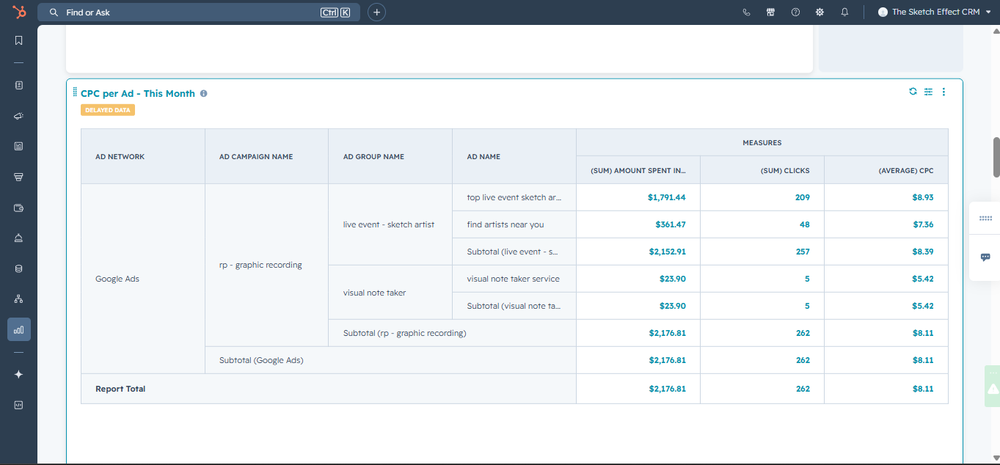

- Managed and optimized Google Ads campaigns, generating 262 paid clicks through CPC monitoring, audience targeting refinement, and acquisition-focused campaign strategy.
- Oversaw campaign performance across niche, high-intent service offerings while maintaining an average CPC of approximately $8.11 in competitive paid search campaigns.
- Analyzed ad group and keyword-level performance data to improve paid traffic quality, campaign efficiency, and lead generation outcomes for a high-value client.

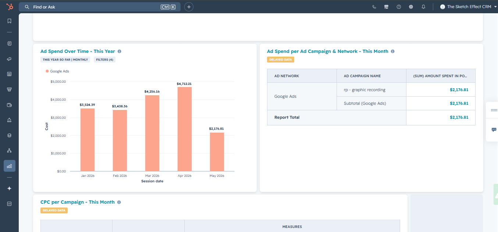

- Managed monthly Google Ads budgets exceeding $4.7K while optimizing paid acquisition campaigns for a high-value client, focused on qualified lead generation and revenue growth.

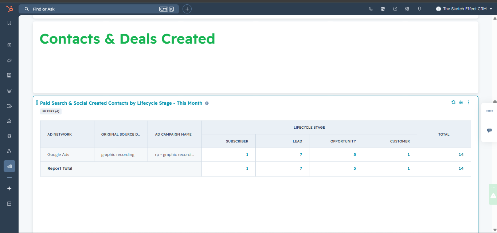

- Managed full-funnel paid acquisition reporting by tracking lifecycle stage progression from lead to opportunity and customer within HubSpot CRM.

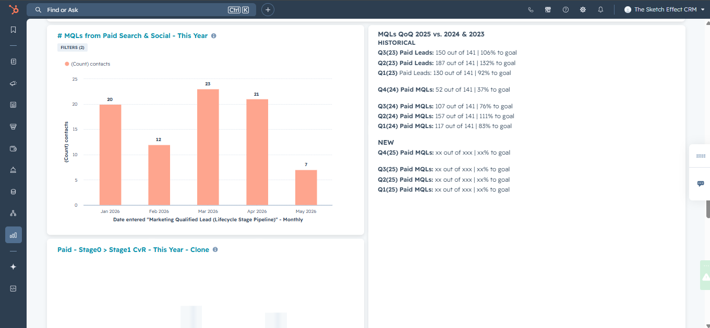

- Generated 83 Marketing Qualified Leads (MQLs) between January–May 2026 for a high-value client through strategic paid search.
- Scaled qualified lead generation to a peak of 23 MQLs in March 2026 through Google Ads optimization, audience targeting refinement, and conversion-focused paid acquisition strategy.
- Maintained consistent pipeline contribution across Q1–Q2 2026, delivering 20+ qualified leads in multiple months for a high-ticket service offering with revenue-driven acquisition campaigns.

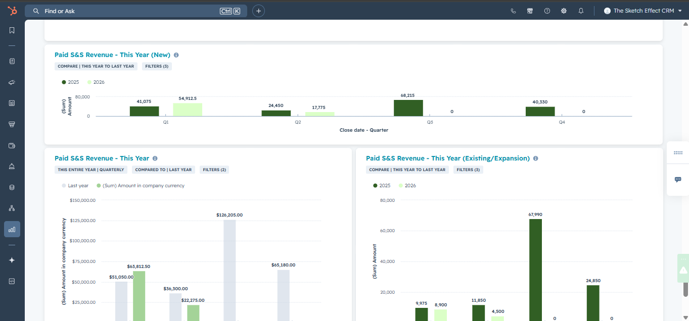

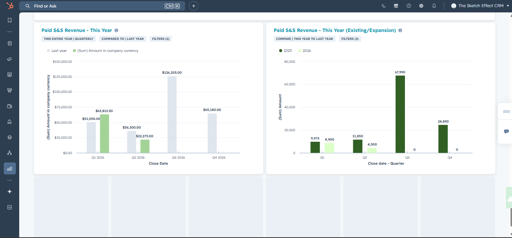

- Increased Q1 paid revenue by approximately 25% YoY through Google Ads optimization, and acquisition-focused paid media strategy.
- Drove approximately $64K in Q1 revenue through management and optimization of paid acquisition campaigns across Google Ads.
- Maintained approximately $10K in existing/expansion revenue in Q1 through ongoing campaign optimization, retention-focused initiatives, and account growth support.

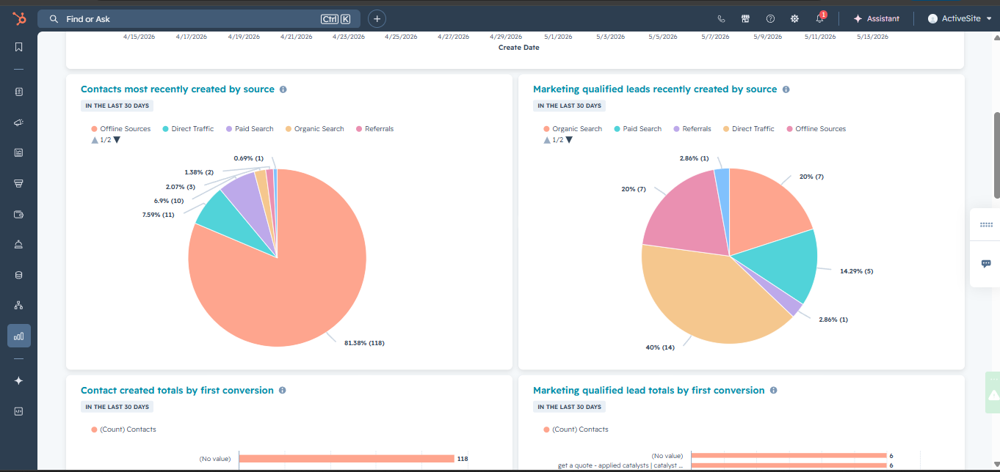

Generated 14.29% of total Marketing Qualified Leads (MQLs) through paid search campaigns while supporting a diversified acquisition strategy across multiple channels.

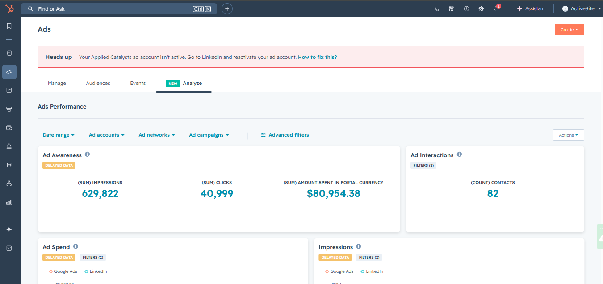

- Drove over 630,000 impressions and 40,000+ clicks at a strong $1.97 average CPC.
- Achieved a 6.5% CTR, significantly above typical industry benchmarks, through highly relevant ad creative and strong audience targeting.
- Generated 82 qualified contacts from paid media over the course of 5 months.

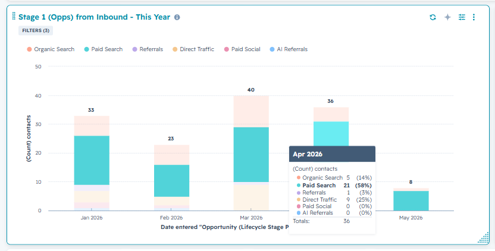

- Through ongoing campaign optimization and keyword management, paid search became the highest-performing inbound channel, capturing 58% of all Stage 1 opportunities, outperforming organic, direct, and all other channels combined.

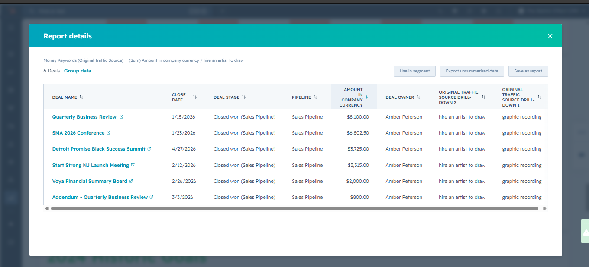

- Discovered a high-intent search term within SEMrush and deployed it within Google Ads, generating $24,742 in closed-won revenue over a 5-month period in 2026. Averaging over $4,120 per corporate deal.
- Tracked corporate enterprise deals from each keyword click to closed-won status through end-to-end data integration between Google Ads and HubSpot CRM.
- Managed the full-funnel tracking of $24,742 across 6 corporate contracts through advanced URL tagging and HubSpot CRM mapping to verify exact Google Ads revenue attribution.

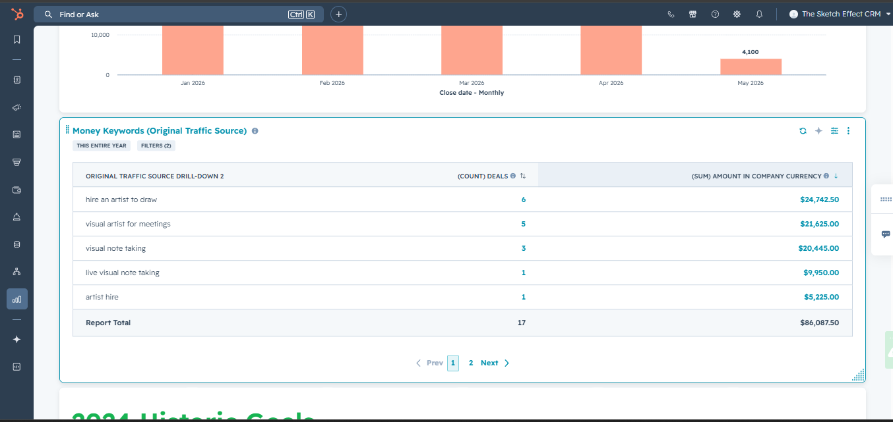

- Generated $86,000+ in total attributed CRM pipeline value through the strategic deployment of high-intent B2B keywords, driving 17 deals with an average contract value of over $5,000.
- Uncovered and scaled a net-new, top-performing keyword search term ("hire an artist to draw") through proactive search term expansion, single-handedly securing 6 closed/active deals and accounting for over $24,700 in revenue.

---

### General Work Examples (Google, SEO, Social Media Management)

- [X/Twitter ads](https://docs.google.com/document/d/1HVEwTow22saeB6PJ48sPt9bfMnw40CcbmhvSp7iQCPI/edit?tab=t.0)
- [SEO efforts](https://docs.google.com/document/d/147GdlF_PtS25DXFi-_Kur5PGXNkRJlKAbeBkk80I8uw/edit)
- [LinkedIn Content Calendar](https://docs.google.com/spreadsheets/d/11RJinHoBkNZLxmSn24GKbKjOjm41hxXTxZsfGxuclHM/edit#gid=0)
- [Content Calendar example](https://docs.google.com/presentation/d/1mGWOOmz1Xz1zDPytyvTMR04Q6u_zbPFSk2FRkIhOtlM/edit#slide=id.p1) (Content calendar for Marketing Agency)
- [YouTube Report](https://docs.google.com/presentation/d/1wtC6a27wpLBD9j6Ex49wM8RfT8wbc-KTJx4Gh9tOkxk/edit)
- [GMB Profile Update Report](https://docs.google.com/document/d/1zRtYmMJzGVrguMIYDZE1B90MTohN8ieUSWse8XAkzvA/edit)
- [Example 1](https://docs.google.com/document/d/1YTbb1LJnuDFfE-6kCjHF0BWf5G1Z7yuq3ENZkHEkmOI/edit)
- [Example 2](https://docs.google.com/document/d/1HFe9GxdaWypn8tOonPkAmZaDakjS6X2NBAcJTcHCnr4/edit)
- [WordPress Website Updates](https://docs.google.com/document/d/1HJNr12eUVyM6aXuJGjMyQOVsbtSlq4E7hcjcgwZdOOM/edit)
- [Rebranding](https://docs.google.com/document/d/1IxHB167raSezAfZVyNgYZbJ3Q0IsfZEDizWqoAyjp0s/edit?usp=sharing)

---

### Results with Google Ads Strategy
*(Results shown in Brazilian real)*

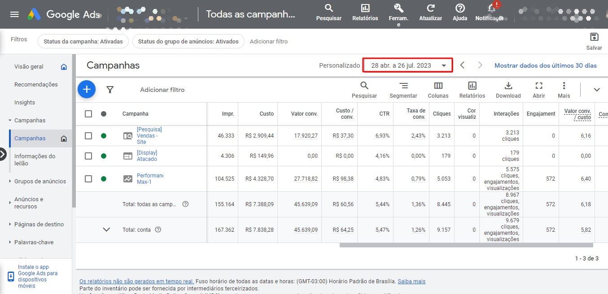

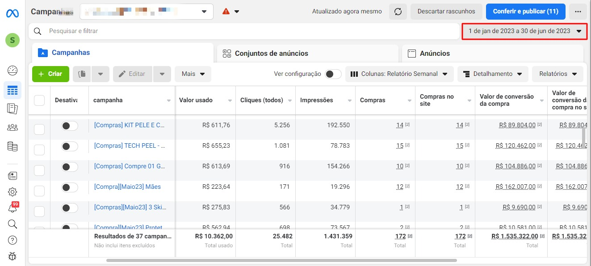

---

### SEO Example
[Le Cigalon Hotel — hiking package page](https://lecigalon.lu/en/package/forfait-romantique/)

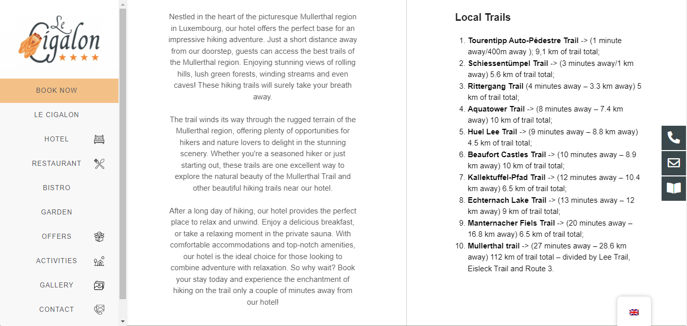

**Alterations made:**

Wrote an SEO-optimized article featuring hiking trails near the hotel, ensuring all relevant trails were included to capture organic traffic from users searching for trail information. Conducted keyword research and created the copy following SEO best practices to improve search visibility and drive qualified traffic to the website.

---

### Ads Example — Supplements Company (Instagram Organic Ads)

---

### Ads Example — Digital Marketing Companies (French, Facebook Ads)

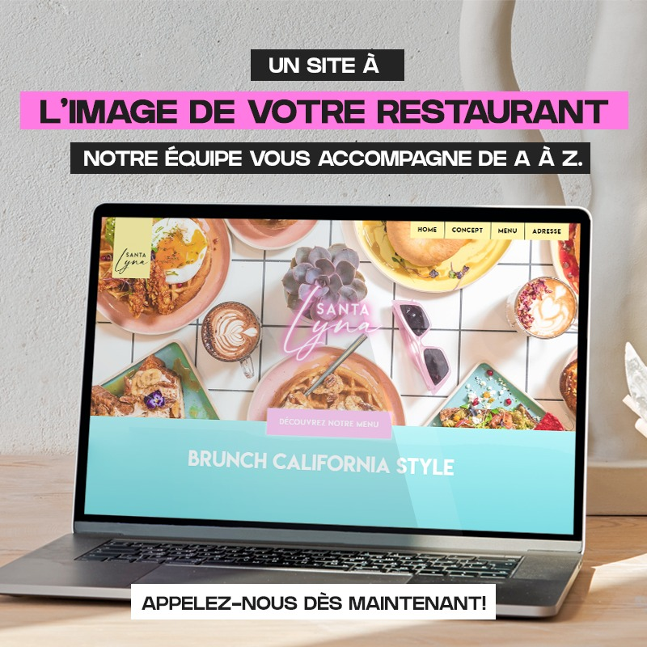
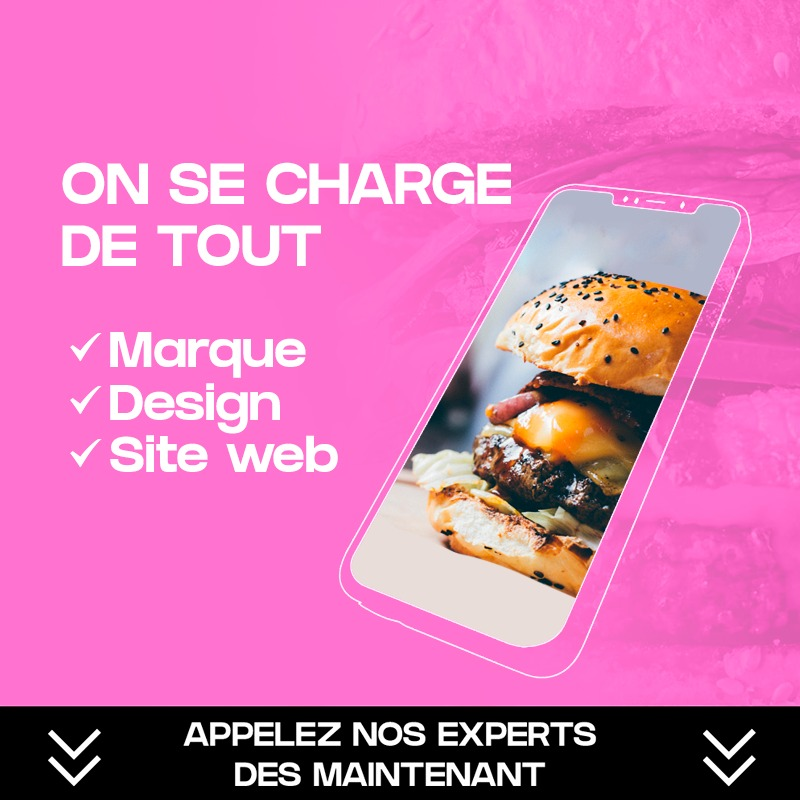
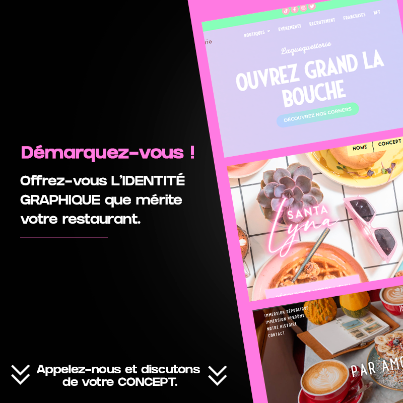
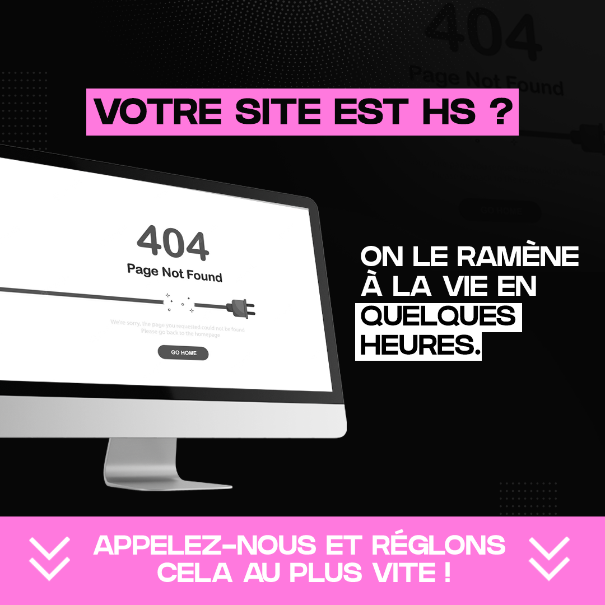

**Ads for hotel (Facebook organic ads):**

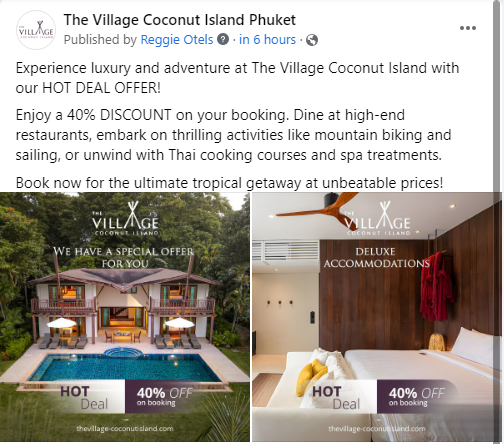
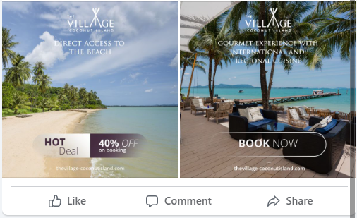

---

### Paid Media Ads Examples (Portuguese Facebook Ad)

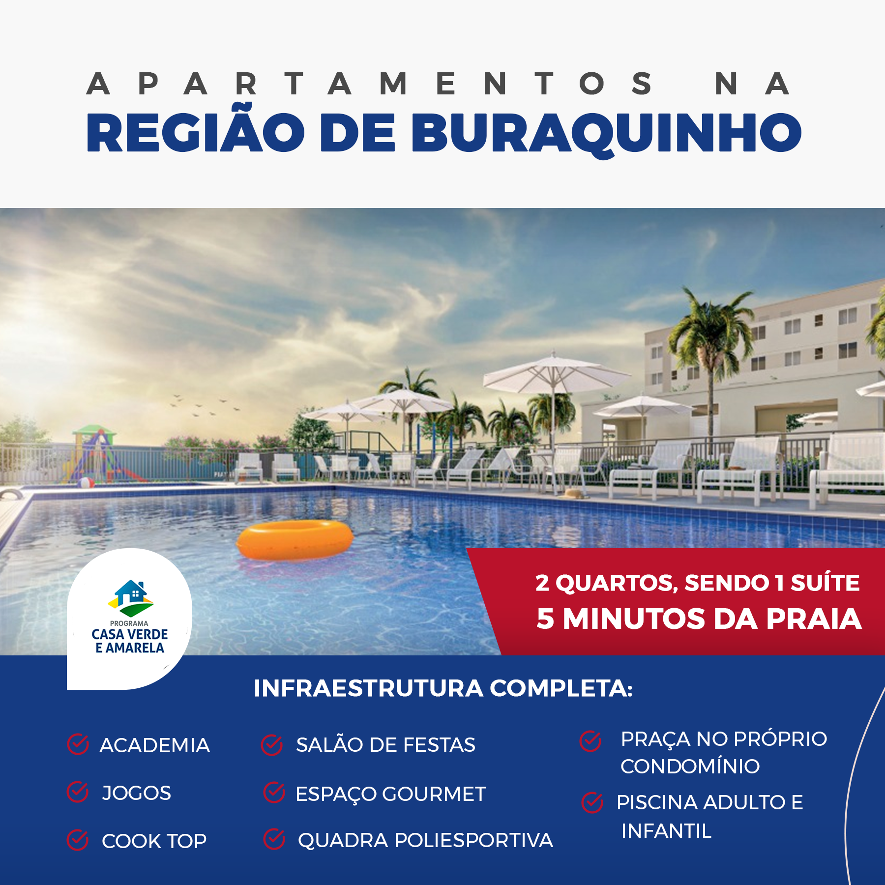
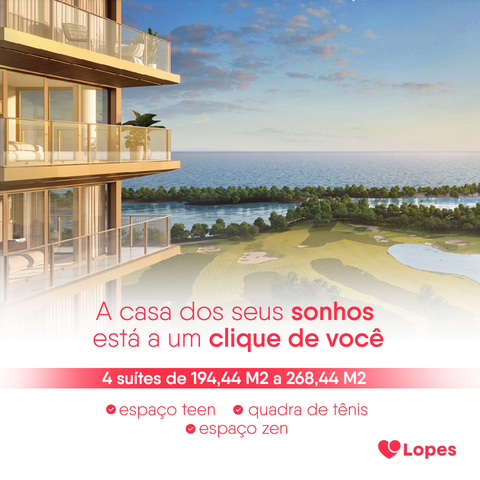
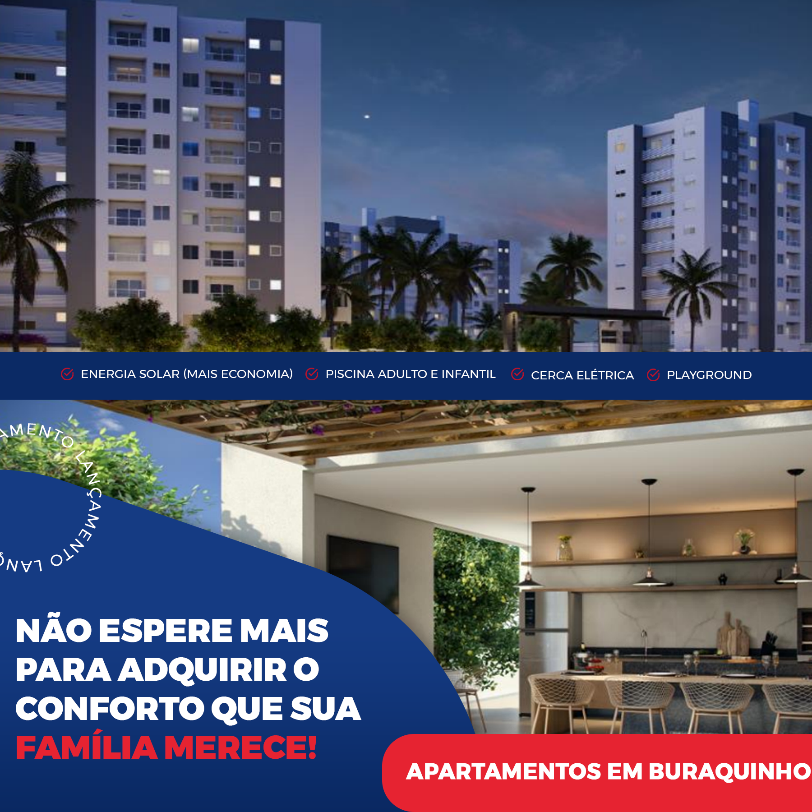

---
